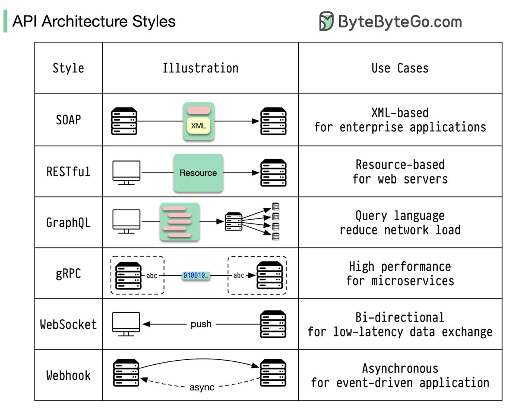

# API Architecture Styles

#### پروژه درس برنامه سازی وب - بهار 1404
#### مدرس: یحیی پورسلطانی

#### تهیه کنندگان:
- پوریا عرفانزاده - 401110918 [(GitHub)](https://github.com/erfnzdeh)
- یاشار پیمایی - 401100325 [(GitHub)](https://github.com/yasharp83)
- امیرحسین سلامی - 401106052 [(GitHub)](https://github.com/amirhoseinsalami)

---

### مقدمه



در چشم‌انداز دیجیتال امروزی، نرم‌افزارها به ندرت به صورت جدا و ایزوله عمل می‌کنند. از اپلیکیشن‌های موبایل که با سرورهای ابری همگام‌سازی می‌شوند تا میکروسرویس‌هایی که یک پلتفرم پیچیده را تشکیل می‌ده دهند، ارتباط یکپارچه و کارآمد میان سیستم‌های مختلف، سنگ بنای فناوری مدرن است. این ارتباطات از طریق واسط‌های برنامه‌نویسی کاربردی یا API ها (Application Programming Interfaces) ممکن می‌شود که به عنوان زبان مشترک و قرارداد ارتباطی بین اجزای نرم‌افزاری عمل می‌کنند.

با این حال، همه نیازهای ارتباطی یکسان نیستند. یک اپلیکیشن چت به تبادل فوری و دوطرفه پیام نیاز دارد، در حالی که یک سیستم بانکی نیازمند تراکنش‌های امن و قابل اطمینان است و یک داشبورد تحلیلی ممکن است به واکشی داده‌های پیچیده از چندین منبع در یک درخواست واحد احتیاج داشته باشد. به همین دلیل، سبک‌های معماری (Architectural Styles) متفاوتی برای طراحی APIها به وجود آمده‌اند که هر یک با رویکرد، مزایا و معایب خاص خود، برای حل دسته‌ای از چالش‌ها بهینه شده‌اند.

در این تحقیق، ما به بررسی عمیق شش مورد از محبوب‌ترین و تأثیرگذارترین سبک‌های معماری API می‌پردازیم: `SOAP`، `REST`، `GraphQL`، `gRPC`، `WebSocket` و `Webhook`. برای هر یک، نحوه عملکرد، نقاط قوت و ضعف، و موارد استفاده ایده‌آل آن‌ها را تشریح خواهیم کرد. هدف این است که با ارائه یک قیاس ساده و مثال‌های کد عملی، درک روشنی از هر الگو ایجاد کرده و در نهایت با جداول مقایسه‌ای، به شما کمک کنیم تا بهترین ابزار را برای نیازهای پروژه خود انتخاب کنید.


### 1\. SOAP (Simple Object Access Protocol)

#### تاریخچه و ضرورت (History & Need)

SOAP در اواخر دهه ۱۹۹۰ توسط شرکت Microsoft با هدف ایجاد یک استاندارد مشترک برای فراخوانی روال از راه دور (RPC) بر روی اینترنت توسعه یافت. در آن زمان، سازمان‌های بزرگ با سیستم‌های ناهمگن مختلف نیاز به راهی استاندارد برای ارتباط بین پلتفرم‌های متفاوت داشتند. SOAP اولین بار در سال ۱۹۹۸ معرفی شد و بعداً به یک استاندارد رسمی W3C تبدیل شد.

قبل از SOAP، سیستم‌های توزیع‌شده مشکلات فراوانی با ناسازگاری‌ها، امنیت، و قابلیت اطمینان در فرآیند انتقال پیام داشتند. SOAP با ارائه یک فرمت پیام استاندارد مبتنی بر XML و مجموعه‌ای از قوانین پردازش سختگیرانه، راه حلی برای این مشکلات ارائه داد. مهم‌تر از همه، SOAP پروتکلی مستقل از پلتفرم و زبان بود که می‌توانست بر روی هر پروتکل انتقالی مانند HTTP، SMTP یا حتی JMS کار کند. 

در دوران شکل‌گیری وب سرویس‌ها، SOAP نقش مهمی در ایجاد معماری مبتنی بر سرویس (SOA) و ارتباطات B2B ایفا کرد. قابلیت‌های پیشرفته SOAP مانند مدیریت تراکنش و امنیت یکپارچه (WS-Security)، آن را برای محیط‌های سازمانی که به قابلیت اطمینان، تضمین تحویل پیام، و امنیت قوی نیاز داشتند، ایده‌آل ساخت.

#### چطور کار می‌کند (How It Works)

SOAP یک protocol بسیار ساختاریافته و مبتنی بر استاندارد است. این پروتکل به یک قرارداد (contract) سختگیرانه متکی است که در فایلی به نام WSDL (Web Services Definition Language) تعریف شده است. تمام ارتباطات به صورت یک "envelope" از نوع XML ارسال می‌شود که شامل یک header و یک body است. Body حاوی داده‌های واقعی request یا response است. این روش بسیار رسمی است و بر روی پروتکل‌های مختلفی از جمله HTTP، SMTP و غیره عمل می‌کند.

#### قیاس کافی شاپ ☕

شما به کافی شاپی می‌روید که سفارش دادن در آن مانند پر کردن یک فرم دولتی است. شما باید از یک "فرم سفارش" خاص (قرارداد WSDL) استفاده کنید. آن را با خودکار، فقط با حروف بزرگ (فرمت XML) پر می‌کنید و در یک پاکت مخصوص (SOAP envelope) قرار می‌دهید. این پاکت را به باریستا تحویل می‌دهید که از مجموعه‌ای از قوانین سختگیرانه برای پردازش آن پیروی می‌کند و قهوه شما را با یک رسید به همان اندازه رسمی برمی‌گرداند. هیچ فضایی برای گفتگوی غیررسمی وجود ندارد.

#### مزایا و معایب (Pros & Cons)

  * **مزایا:**
      * **امنیت بالا (High Security):** از استانداردهای امنیتی پیشرفته مانند WS-Security پشتیبانی می‌کند.
      * **سازگاری با ACID:** قابلیت اطمینان و یکپارچگی تراکنش‌ها را تضمین می‌کند که برای برنامه‌های مالی حیاتی است.
      * **مستقل از پروتکل (Protocol Agnostic):** می‌تواند بر روی هر پروتکل انتقالی (HTTP، SMTP و غیره) کار کند.
  * **معایب:**
      * **پرحرفی (Verbosity):** فرمت XML بسیار متنی است که منجر به اندازه‌های بزرگتر request/response و عملکرد کندتر می‌شود.
      * **پیچیدگی (Complexity):** استانداردهای سختگیرانه و ساختار XML، توسعه و دیباگ کردن را دشوار می‌کند.
      * **عملکرد پایین (Low Performance):** سربار ناشی از پارس کردن XML آن را کندتر از سبک‌های دیگر می‌کند.

#### چه زمانی از آن استفاده کنیم (When to Use It)

از SOAP برای **برنامه‌های سطح enterprise** که به امنیت بالا و قابلیت اطمینان تراکنشی نیاز دارند، استفاده کنید. به سیستم‌های بانکی، سیستم‌های قدیمی (legacy) یا درگاه‌های پرداخت فکر کنید که در آن‌ها یک قرارداد رسمی بین سیستم‌ها غیرقابل مذاکره است.

#### مثال Java (Spring Boot)

استفاده از SOAP در Spring Boot مدرن به dependency `spring-boot-starter-web-services` نیاز دارد. راه‌اندازی آن پیچیده‌تر است، اما در اینجا یک endpoint ساده‌شده آورده شده است.

```java
// این وب سرویس endpoint را تعریف می‌کند
@Endpoint
public class CoffeeEndpoint {
    private static final String NAMESPACE_URI = "http://www.example.com/coffee";

    // این متد به عنوان یک عملیات SOAP در دسترس قرار می‌گیرد
    @PayloadRoot(namespace = NAMESPACE_URI, localPart = "getCoffeeRequest")
    @ResponsePayload
    public GetCoffeeResponse getCoffee(@RequestPayload GetCoffeeRequest request) {
        GetCoffeeResponse response = new GetCoffeeResponse();
        // منطق پیدا کردن قهوه بر اساس درخواست...
        Coffee coffee = new Coffee();
        coffee.setName(request.getName());
        coffee.setPrice(3.50);
        response.setCoffee(coffee);
        return response;
    }
}
```

*توجه: این کد به کلاس‌های تولید شده از یک فایل WSDL/XSD نیاز دارد (`GetCoffeeRequest`، `GetCoffeeResponse` و غیره)، که بخش کلیدی فرآیند توسعه SOAP است.*

-----

### 2\. REST (Representational State Transfer)

#### تاریخچه و ضرورت (History & Need)

REST در سال ۲۰۰۰ توسط Roy Fielding در رساله دکترای خود معرفی شد. فیلدینگ که یکی از نویسندگان اصلی مشخصات HTTP بود، REST را به عنوان یک سبک معماری برای سیستم‌های توزیع‌شده هایپرمدیا مانند وب جهانی (World Wide Web) ارائه داد.

REST در زمانی ظهور کرد که وب در حال رشد سریع بود، اما با چالش‌های مقیاس‌پذیری، انعطاف‌پذیری، و استقلال از پلتفرم مواجه بود. SOAP به عنوان استاندارد رایج آن زمان، اگرچه قدرتمند بود، اما فاقد سادگی لازم برای توسعه سریع بود و با زیرساخت وب به طور طبیعی سازگار نبود. همچنین سربار عملکردی قابل توجهی داشت.

REST بر خلاف SOAP، یک رویکرد بسیار ساده‌تر و سبک‌تر را ارائه داد که از پروتکل HTTP موجود بهره می‌برد. این سبک معماری با معرفی مفاهیمی مانند منابع (resources)، نمایش (representations)، و وضعیت (state)، به توسعه‌دهندگان امکان داد تا APIهای مقیاس‌پذیر و انعطاف‌پذیر ایجاد کنند که با محیط وب سازگار باشند.

با گسترش وب ۲.۰ و افزایش نیاز به APIهای باز، REST به استاندارد طلایی برای توسعه APIهای وب تبدیل شد. سادگی، سازگاری با ابزارهای موجود وب، و فلسفه طراحی stateless آن، REST را به انتخاب مطلوب برای اپلیکیشن‌های موبایل و وب مدرن تبدیل کرد. گسترش JSON به عنوان فرمت سبک‌تر برای تبادل داده، در مقایسه با XML، نیز به محبوبیت REST کمک کرد.

#### چطور کار می‌کند (How It Works)

REST یک سبک معماری است، نه یک پروتکل. این سبک از ویژگی‌های موجود پروتکل HTTP استفاده می‌کند. REST حول ایده **resources** (مانند `/coffees`، `/customers`) ساخته شده است که با استفاده از متدهای استاندارد HTTP مانند `GET` (خواندن)، `POST` (ایجاد)، `PUT` (به‌روزرسانی) و `DELETE` (حذف) دستکاری می‌شوند. این سبک stateless است، به این معنی که هر request شامل تمام اطلاعات مورد نیاز برای پردازش آن است. داده‌ها معمولاً در فرمت JSON مبادله می‌شوند.

#### قیاس کافی شاپ ☕

این کافی شاپ استاندارد شماست. یک منو روی دیوار وجود دارد (مستندات API). شما از زبان ساده و جهانی استفاده می‌کنید:

  * "می‌توانم لیست تمام قهوه‌ها را **GET** کنم؟" (`GET /coffees`)
  * "می‌خواهم یک سفارش جدید برای لاته **POST** کنم." (`POST /orders`)
  * "می‌خواهم شکر اضافی در سفارش شماره ۱۲۳ **PUT** کنم." (`PUT /orders/123`)
  * "لطفاً سفارش شماره ۱۲۳ من را **DELETE** کنید." (`DELETE /orders/123`)
    باریستا این افعال رایج را می‌فهمد و می‌داند چه کاری باید انجام دهد.

#### مزایا و معایب (Pros & Cons)

  * **مزایا:**
      * **سادگی (Simplicity):** درک آن آسان است و از متدهای استاندارد HTTP استفاده می‌کند.
      * **مقیاس‌پذیری (Scalability):** ماهیت stateless آن، مقیاس‌پذیری افقی را آسان می‌کند.
      * **انعطاف‌پذیری (Flexibility):** می‌تواند داده‌ها را در فرمت‌های مختلف (JSON، XML و غیره) برگرداند، که JSON رایج‌ترین است.
      * **پذیرش گسترده (Wide Adoption):** جامعه پشتیبانی و ابزارهای بسیار بزرگی در دسترس است.
  * **معایب:**
      * **دریافت داده اضافی یا ناکافی (Over/Under-fetching):** ممکن است داده‌های زیادی دریافت کنید (مثلاً تمام جزئیات کاربر در حالی که فقط به نام او نیاز دارید) یا داده‌های خیلی کم، که نیاز به چندین request دارد.
      * **عدم وجود قرارداد رسمی (No Formal Contract):** هیچ قرارداد قابل خواندن توسط ماشین مانند WSDL در SOAP وجود ندارد (اگرچه OpenAPI/Swagger به این موضوع کمک می‌کند).

#### چه زمانی از آن استفاده کنیم (When to Use It)

REST **انتخاب پیش‌فرض برای اکثر APIهای عمومی و وب سرویس‌ها** است. این سبک برای اپلیکیشن‌های موبایل، اپلیکیشن‌های تک‌صفحه‌ای (single-page applications) و میکروسرویس‌های عمومی عالی است.

#### مثال Java (Spring Boot)

این مثال، کار اصلی و رایج در Spring Boot است.

```java
@RestController
@RequestMapping("/coffees")
public class CoffeeController {

    // یک رکورد ساده Coffee را نمایش می‌دهد
    public record Coffee(String name, double price) {}

    // GET http://localhost:8080/coffees/latte
    @GetMapping("/{name}")
    public Coffee getCoffeeByName(@PathVariable String name) {
        // در یک برنامه واقعی، این اطلاعات را از دیتابیس می‌گیرید
        if ("latte".equalsIgnoreCase(name)) {
            return new Coffee("Latte", 3.75);
        }
        return null; // یا یک exception پرتاب کنید
    }
}
```

-----

### 3\. GraphQL

#### تاریخچه و ضرورت (History & Need)

GraphQL در سال ۲۰۱۲ توسط Facebook به صورت داخلی توسعه یافت و در سال ۲۰۱۵ به صورت عمومی منتشر شد. این فناوری در پاسخ به محدودیت‌های APIهای RESTful و نیازهای خاص Facebook برای اپلیکیشن‌های موبایل ایجاد شد.

Facebook با چالش‌های منحصربه‌فردی روبرو بود: آن‌ها باید میلیون‌ها کاربر را با سرعت بالا و در شبکه‌های کم‌سرعت موبایل پشتیبانی می‌کردند. محدودیت‌های REST مانند over-fetching (دریافت داده‌های بیشتر از نیاز) و under-fetching (نیاز به چندین درخواست برای گرفتن داده‌های مرتبط) به خصوص در محیط‌های موبایل با پهنای باند محدود، مشکل‌ساز شده بود.

با گسترش اپلیکیشن‌های تک‌صفحه‌ای (SPA) و اپلیکیشن‌های موبایل، نیاز به واکشی دقیق داده افزایش یافت. APIهای RESTful با ساختار از پیش تعریف‌شده، انعطاف‌پذیری محدودی داشتند. کاربردهای پیچیده اغلب به چندین درخواست برای دریافت داده‌های مرتبط نیاز داشتند که منجر به تأخیر بیشتر می‌شد.

GraphQL یک پارادایم متفاوت را معرفی کرد: یک API با یک endpoint واحد که به کلاینت‌ها امکان می‌داد دقیقاً مشخص کنند چه داده‌هایی را نیاز دارند. این رویکرد client-driven به جای server-driven، کنترل بیشتری به توسعه‌دهندگان فرانت‌اند داد و برای کاربردهای پیچیده با نیازهای داده‌ای متنوع، کارایی بیشتری فراهم کرد.

با افزایش پیچیدگی اکوسیستم‌های نرم‌افزاری و افزایش تعداد پلتفرم‌های کلاینت (وب، موبایل iOS، Android، و غیره) که با یک بک‌اند تعامل می‌کردند، GraphQL به سرعت محبوبیت پیدا کرد. تا سال ۲۰۱۸، شرکت‌های بزرگی مانند GitHub، Twitter، و Airbnb همگی GraphQL را پذیرفته بودند و در سال ۲۰۱۹، GraphQL Foundation تحت پروژه Linux Foundation تأسیس شد.

#### چطور کار می‌کند (How It Works)

GraphQL یک زبان پرس‌وجو (query language) برای APIها است. به جای داشتن endpointهای زیاد که ساختارهای داده ثابتی را برمی‌گردانند (مانند REST)، GraphQL یک endpoint واحد را ارائه می‌دهد. Client یک **query** ارسال می‌کند که *دقیقاً* داده‌های مورد نیاز خود را مشخص می‌کند و server یک شیء JSON با ساختاری که آینه‌ی query است، برمی‌گرداند. این کار مشکل over/under-fetching در REST را حل می‌کند.

#### قیاس کافی شاپ ☕

شما به سمت باریستا می‌روید و یک سفارش بسیار خاص می‌دهید: "من یک قهوه بزرگ می‌خواهم و برای آن قهوه فقط باید قیمت و مبدأ آن را بدانم. همچنین یک کروسان می‌خواهم، اما فقط به تعداد کالری آن نیاز دارم." شما دقیقاً همان چیزی را که خواسته‌اید در یک نوبت دریافت می‌کنید—نه بیشتر، نه کمتر.

#### مزایا و معایب (Pros & Cons)

  * **مزایا:**
      * **واکشی کارآمد داده (Efficient Data Fetching):** مشکل over/under-fetching وجود ندارد. Clientها دقیقاً همان چیزی را که می‌خواهند دریافت می‌کنند.
      * **یک Request واحد (Single Request):** می‌تواند تمام داده‌های مورد نیاز را در یک فراخوانی API دریافت کند و رفت و برگشت‌های شبکه را کاهش دهد.
      * **اسکیمای قویاً تایپ‌شده (Strongly Typed Schema):** API خود-مستندساز است و کمتر مستعد خطا است.
  * **معایب:**
      * **پیچیدگی سمت سرور (Server-side Complexity):** پیاده‌سازی یک سرور GraphQL می‌تواند پیچیده‌تر از یک REST API باشد.
      * **کش کردن پیچیده (Complex Caching):** کش کردن در مقایسه با کش کردن مبتنی بر resource در REST دشوارتر است.
      * **مشکلات پیچیدگی Query:** یک query مخرب یا با ساختار ضعیف می‌تواند بار سنگینی را روی سرور قرار دهد.

#### چه زمانی از آن استفاده کنیم (When to Use It)

GraphQL برای **اپلیکیشن‌های موبایل** که پهنای باند شبکه در آن‌ها مهم است و برای اپلیکیشن‌های فرانت‌اند پیچیده که نیاز به واکشی داده از چندین منبع دارند (مانند داشبوردی که اطلاعات کاربر، سفارش‌ها و نقدها را همزمان نشان می‌دهد) عالی است.

#### مثال Java (Spring Boot)

شما به dependency `spring-boot-starter-graphql` نیاز دارید. ابتدا یک schema تعریف کنید.

`src/main/resources/graphql/schema.graphqls`

```graphql
type Query {
    coffeeByName(name: String): Coffee
}

type Coffee {
    name: String
    price: Double
    origin: String
}
```

سپس، یک controller برای پاسخ به query ایجاد کنید.

```java
@Controller
public class CoffeeController {

    // این متد به query "coffeeByName" در schema مپ می‌شود
    @QueryMapping
    public Coffee coffeeByName(@Argument String name) {
        if ("latte".equalsIgnoreCase(name)) {
            // در یک برنامه واقعی، از یک سرویس/دیتابیس واکشی کنید
            return new Coffee("Latte", 3.75, "Colombia");
        }
        return null;
    }

    // یک کلاس داده ساده
    public record Coffee(String name, double price, String origin) {}
}
```

-----

### 4\. gRPC (gRPC Remote Procedure Call)

#### تاریخچه و ضرورت (History & Need)

gRPC در سال ۲۰۱۵ توسط Google معرفی شد. این فناوری محصول سال‌ها تجربه Google در طراحی و پیاده‌سازی سیستم‌های توزیع‌شده بزرگ مقیاس بود. gRPC نسل بعدی سیستم RPC داخلی Google به نام Stubby است که برای ارتباط بین میلیون‌ها میکروسرویس در دیتاسنترهای Google استفاده می‌شد.

با ظهور معماری میکروسرویس، نیاز به یک پروتکل ارتباطی با کارایی بالا، کم‌حجم و قابل استفاده در زبان‌های مختلف برنامه‌نویسی افزایش یافت. APIهای RESTful اگرچه برای ارتباطات بیرونی و تعامل با وب مناسب بودند، اما برای ارتباطات داخلی بین سرویس‌ها، به خصوص در محیط‌های با حجم تراکنش بالا، سربار زیادی داشتند. JSON به عنوان فرمت تبادل داده در REST، هرچند خوانا برای انسان، اما از نظر پردازش و اندازه بهینه نبود.

gRPC با ارائه یک چارچوب مدرن RPC مبتنی بر Protocol Buffers (یک فرمت سریال‌سازی داده کارآمد و قابل توسعه) و HTTP/2 (با ویژگی‌های پیشرفته مانند multiplexing و فشرده‌سازی هدر)، پاسخی به این نیازها بود. هدف اصلی آن ارائه قابلیت‌های زیر بود:
- کارایی بالا و تأخیر کم برای ارتباطات سرویس به سرویس
- استریمینگ داده‌ها به صورت دوطرفه
- پشتیبانی از انواع مختلف ارتباط: یک‌طرفه، دوطرفه، همزمان و غیرهمزمان
- تعامل‌پذیری بین زبان‌های مختلف برنامه‌نویسی (polyglot)
- تولید خودکار کد برای کلاینت و سرور

با گسترش معماری میکروسرویس و نیاز روزافزون به کارایی بالا در سیستم‌های توزیع‌شده، gRPC به سرعت به یکی از انتخاب‌های محبوب برای طراحی APIهای داخلی در بسیاری از سازمان‌های بزرگ تبدیل شد. این فناوری به خصوص در محیط‌های پردازش ابری، اینترنت اشیا (IoT)، و سیستم‌های پردازش داده با حجم بالا مورد استقبال قرار گرفت.

#### چطور کار می‌کند (How It Works)

gRPC یک فریم‌ورک RPC با کارایی بالا است که توسط گوگل توسعه یافته است. این فریم‌ورک "contract-first" است و از **Protocol Buffers (.proto files)** برای تعریف سرویس‌ها و ساختارهای پیام استفاده می‌کند. سپس این قرارداد برای تولید کد client و server به زبان‌های مختلف استفاده می‌شود. gRPC از HTTP/2 برای انتقال استفاده می‌کند که ویژگی‌هایی مانند bidirectional streaming و multiplexing را امکان‌پذیر می‌سازد و آن را بسیار سریع و کارآمد می‌کند. داده‌ها در فرمت باینری فشرده ارسال می‌شوند، نه متن قابل خواندن توسط انسان.

#### قیاس کافی شاپ ☕

شما و باریستا یک زبان اختصاری از پیش تعیین‌شده و فوق‌العاده کارآمد دارید. به جای گفتن "من یک لاته بزرگ با شیر جو می‌خواهم"، فقط می‌گویید **"سفارش 5B\!"**. باریستا فوراً می‌فهمد منظور شما چیست، زیرا هر دوی شما قبلاً همان "کتابچه راهنمای اختصاری" (فایل `.proto`) را مطالعه کرده‌اید. مکالمه فوق‌العاده سریع است و از کلمات بسیار کمی استفاده می‌کند (فرمت باینری).

#### مزایا و معایب (Pros & Cons)

  * **مزایا:**
      * **کارایی بالا (High Performance):** از HTTP/2 و سریال‌سازی باینری برای تأخیر بسیار کم استفاده می‌کند.
      * **استریمینگ (Streaming):** از استریمینگ سمت client، سمت server و دوطرفه (bidirectional) پشتیبانی می‌کند.
      * **قرارداد قویاً تایپ‌شده (Strongly Typed Contract):** فایل `.proto` تضمین می‌کند که client و server همیشه هماهنگ هستند.
      * **چندزبانه (Polyglot):** تولید کد عالی برای بسیاری از زبان‌ها.
  * **معایب:**
      * **پشتیبانی محدود در مرورگر (Limited Browser Support):** نمی‌توان آن را مستقیماً از یک مرورگر بدون پراکسی فراخوانی کرد.
      * **غیرقابل خواندن برای انسان (Not Human-Readable):** فرمت باینری بدون ابزارهای خاص به سختی قابل دیباگ است.
      * **وابستگی بیشتر (Tighter Coupling):** Client و server به دلیل قرارداد سختگیرانه، وابستگی بیشتری به یکدیگر دارند.

#### چه زمانی از آن استفاده کنیم (When to Use It)

gRPC **بهترین انتخاب برای ارتباطات داخلی میکروسرویس به میکروسرویس** است. کارایی بالای آن برای سیستم‌هایی که تأخیر کم در آن‌ها حیاتی است، عالی است. همچنین برای clientهای موبایل که با سرویس‌های بک‌اند ارتباط برقرار می‌کنند، گزینه بسیار خوبی است.

#### مثال Java (Spring Boot)

ابتدا، یک فایل `.proto` تعریف می‌کنید.

`src/main/proto/coffee.proto`

```proto
syntax = "proto3";
option java_multiple_files = true;
package com.example.coffee;

service CoffeeService {
  rpc GetCoffee(CoffeeRequest) returns (CoffeeResponse) {}
}

message CoffeeRequest {
  string name = 1;
}

message CoffeeResponse {
  string name = 1;
  double price = 2;
}
```

پس از build کردن پروژه، این فایل کلاس‌های Java را تولید می‌کند. سپس شما سرویس را پیاده‌سازی می‌کنید.

```java
// به dependencyهای gRPC starter نیاز دارد
@GrpcService
public class CoffeeServiceImpl extends CoffeeServiceGrpc.CoffeeServiceImplBase {

    @Override
    public void getCoffee(CoffeeRequest request, StreamObserver<CoffeeResponse> responseObserver) {
        CoffeeResponse response = CoffeeResponse.newBuilder()
                .setName(request.getName())
                .setPrice(3.75)
                .build();
        
        responseObserver.onNext(response);
        responseObserver.onCompleted();
    }
}
```

-----

### 5\. WebSocket

#### تاریخچه و ضرورت (History & Need)

پروتکل WebSocket در سال ۲۰۰۸ طراحی شد و در سال ۲۰۱۱ توسط IETF استاندارد شد. این پروتکل در پاسخ به نیاز فزاینده برای ارتباطات همزمان و دوطرفه در وب بوجود آمد. قبل از WebSocket، توسعه‌دهندگان برای ایجاد تجربیات تعاملی و به‌روزرسانی‌های زنده در وب، به تکنیک‌هایی مانند Long Polling یا Comet متکی بودند که بهینه نبودند.

در اوایل دهه ۲۰۰۰، وب اساساً یک مدل درخواست-پاسخ یک‌طرفه داشت: مرورگر کاربر درخواستی ارسال می‌کرد و سرور پاسخ می‌داد. برای هر تعاملی، یک درخواست HTTP جدید لازم بود. این مدل برای محتوای استاتیک مناسب بود، اما با ظهور برنامه‌های وب تعاملی مانند چت‌های آنلاین، بازی‌های چندنفره، و سیستم‌های معاملاتی، محدودیت‌های آن آشکار شد.

برای رفع این محدودیت‌ها، راهکارهای موقتی مانند "Ajax polling" (ارسال درخواست‌های HTTP مکرر برای بررسی به‌روزرسانی‌ها) و "Long polling" (نگهداری اتصال HTTP باز تا زمانی که داده‌ای برای ارسال وجود داشته باشد) توسعه یافتند. اما این تکنیک‌ها مشکلات خود را داشتند:
- سربار شبکه قابل توجه به دلیل هدرهای HTTP تکراری
- تأخیر در انتقال داده‌های زنده
- پیچیدگی پیاده‌سازی
- مشکلات مقیاس‌پذیری در سمت سرور

WebSocket راه‌حلی بنیادی برای این چالش‌ها ارائه داد: یک کانال ارتباطی پایدار و دوطرفه که فقط با یک هندشیک HTTP اولیه برقرار می‌شد. این پروتکل پس از برقراری اتصال، سربار بسیار کمی داشت و امکان ارتباطات بی‌درنگ را فراهم می‌کرد.

با گسترش برنامه‌های وب زنده و تعاملی، WebSocket به سرعت پذیرش گسترده‌ای یافت. سرویس‌های مدرن مانند سیستم‌های پیام‌رسانی آنلاین، پلتفرم‌های معاملات مالی، داشبوردهای زنده، بازی‌های آنلاین و سیستم‌های IoT همگی از این پروتکل برای ارائه قابلیت‌های بی‌درنگ بهره می‌برند.

#### چطور کار می‌کند (How It Works)

WebSocket یک **کانال ارتباطی پایدار و full-duplex (دوطرفه)** بر روی یک اتصال TCP واحد فراهم می‌کند. اتصال با یک request استاندارد HTTP "Upgrade" آغاز می‌شود. پس از برقراری اتصال، هم client و هم server می‌توانند در هر زمان و بدون نیاز به یک request جدید، برای یکدیگر پیام ارسال کنند. این برای برنامه‌های real-time ایده‌آل است.

#### قیاس کافی شاپ ☕

شما به باریستا می‌گویید: "حساب من را باز نگه دار." اکنون شما یک خط ارتباطی مستقیم و باز دارید. می‌توانید بپرسید "آیا سفارش من آماده است؟" و باریستا می‌تواند شما را صدا بزند و بگوید: "کروسان شما همین الان از فر بیرون آمد\!" بدون اینکه لازم باشد شما بپرسید. این یک مکالمه مداوم و دوطرفه است.

#### مزایا و معایب (Pros & Cons)

  * **مزایا:**
      * **زمان واقعی (Real-Time):** ارتباط فوری و دوطرفه را امکان‌پذیر می‌سازد.
      * **تأخیر کم (Low Latency):** پس از دست‌دهی اولیه (handshake)، پیام‌ها با سربار بسیار کمی ارسال می‌شوند.
      * **کارایی (Efficiency):** نیاز به polling مکرر از سوی client را از بین می‌برد.
  * **معایب:**
      * **حالت‌مند (Stateful):** اتصالات طولانی‌مدت هستند که می‌تواند برای مقیاس‌پذیری سرورها یک چالش باشد.
      * **مناسب برای CRUD استاندارد نیست:** برای الگوی request/response ساده در REST طراحی نشده است.
      * **مشکلات پراکسی/فایروال:** برخی زیرساخت‌های شبکه قدیمی ممکن است از اتصالات WebSocket پشتیبانی نکنند.

#### چه زمانی از آن استفاده کنیم (When to Use It)

از WebSocket برای هر برنامه‌ای که به **تبادل داده به صورت real-time** نیاز دارد، استفاده کنید. این شامل **برنامه‌های چت، نوتیفیکیشن‌های زنده، بازی‌های آنلاین و پلتفرم‌های معاملات مالی** می‌شود.

#### مثال Java (Spring Boot)

ابتدا، endpoint مربوط به WebSocket را پیکربندی کنید.

```java
@Configuration
@EnableWebSocket
public class WebSocketConfig implements WebSocketConfigurer {

    @Override
    public void registerWebSocketHandlers(WebSocketHandlerRegistry registry) {
        registry.addHandler(new CoffeeOrderHandler(), "/coffee-orders");
    }
}
```

سپس، handler را برای پردازش پیام‌ها ایجاد کنید.

```java
public class CoffeeOrderHandler extends TextWebSocketHandler {

    @Override
    public void handleTextMessage(WebSocketSession session, TextMessage message) throws IOException {
        String payload = message.getPayload(); // مثلاً: "orderStatus:123"
        System.out.println("آپدیت سفارش دریافت شد: " + payload);

        // یک پیام به client ارسال کنید
        session.sendMessage(new TextMessage("وضعیت سفارش ۱۲۳: در حال آماده‌سازی"));
    }
}
```

-----

### 6\. Webhook

#### تاریخچه و ضرورت (History & Need)

Webhookها در اوایل دهه ۲۰۱۰ به عنوان یک الگوی طراحی API محبوبیت یافتند، اگرچه مفهوم پایه آنها (callback URL) قدیمی‌تر بود. اصطلاح "webhook" اولین بار توسط Jeff Lindsay در حدود سال ۲۰۰۷ رواج پیدا کرد. این مفهوم ساده اما قدرتمند در پاسخ به محدودیت‌های مدل سنتی درخواست-پاسخ APIها به وجود آمد.

قبل از webhookها، اپلیکیشن‌ها برای دریافت به‌روزرسانی‌ها و تغییرات از سرویس‌های دیگر، مجبور بودند به طور مداوم polling کنند - یعنی به طور منظم درخواست‌هایی ارسال کنند تا بررسی کنند آیا اطلاعات جدیدی وجود دارد یا خیر. این رویکرد چندین مشکل داشت:
- مصرف منابع و پهنای باند غیرضروری در زمانی که تغییری وجود نداشت
- تأخیر بین زمان وقوع رویداد و زمان کشف آن توسط کلاینت
- پیچیدگی پیاده‌سازی در سمت کلاینت
- مقیاس‌پذیری ضعیف در سیستم‌هایی با تعداد زیاد کلاینت

با گسترش خدمات SaaS (نرم‌افزار به عنوان سرویس) و اکوسیستم‌های API، نیاز به یک راه‌حل کارآمدتر برای ارتباط بین سیستم‌ها آشکار شد. Webhookها یک راه‌حل ساده و مؤثر ارائه دادند: به جای polling، سیستم‌ها می‌توانستند URLهای خود را ثبت کنند تا هنگام رخداد تغییرات مهم، به صورت خودکار مطلع شوند.

شرکت‌های پیشگام در این زمینه مانند GitHub، PayPal و Stripe با پیاده‌سازی webhookها در APIهای خود، به محبوبیت این الگو کمک کردند. این باعث شد توسعه‌دهندگان بتوانند یکپارچه‌سازی‌های بسیار کارآمدتر و واکنشی‌تری بسازند. به عنوان مثال، سیستم CI/CD می‌توانست به محض push شدن کد به یک repository، به طور خودکار فرایند build را آغاز کند یا یک فروشگاه آنلاین می‌توانست به محض تأیید پرداخت، بلافاصله فرایند ارسال را شروع کند.

امروزه، webhookها یک جزء اساسی در معماری‌های مدرن نرم‌افزاری، به ویژه در زمینه‌های رویدادمحور (event-driven)، اتوماسیون، و یکپارچه‌سازی سیستم‌ها هستند. آنها به خصوص در اکوسیستم‌های سرویس‌های میکرو، پردازش رویدادها و معماری‌های واکنش‌گرا (reactive) نقش مهمی ایفا می‌کنند.

#### چطور کار می‌کند (How It Works)

Webhook یک "reverse API" است. به جای اینکه اپلیکیشن شما برای اطلاعات جدید از یک سرور polling کند (pull)، سرور **هنگامی که یک رویداد رخ می‌دهد، endpoint اپلیکیشن شما را فراخوانی می‌کند** (push). شما یک URL را در سرویس منبع ثبت می‌کنید و به آن می‌گویید به کدام رویدادها علاقه‌مند هستید. هنگامی که یکی از آن رویدادها اتفاق می‌افتد، سرویس منبع یک request از نوع HTTP POST به URL شما با جزئیات رویداد ارسال می‌کند.

#### قیاس کافی شاپ ☕

شما قهوه‌تان را سفارش می‌دهید و به باریستا می‌گویید: "شماره میز من ۷ است. هر وقت آماده شد آن را به میزم بیاورید." شما کنار پیشخوان منتظر نمی‌مانید. می‌روید و روی میزتان می‌نشینید و کتاب می‌خوانید (اپلیکیشن شما کارهای دیگری انجام می‌دهد). وقتی سفارش آماده می‌شود (رویداد رخ می‌دهد)، یک پیشخدمت آن را به میز شما می‌آورد (سیستم منبع یک request از نوع POST به URL ثبت‌شده شما ارسال می‌کند). ارتباط توسط کافی شاپ آغاز می‌شود.

#### مزایا و معایب (Pros & Cons)

  * **مزایا:**
      * **کارآمدی (Efficiency):** نیازی به polling مداوم نیست که باعث صرفه‌جویی در منابع هم برای client و هم برای server می‌شود.
      * **به‌روزرسانی‌های Real-Time:** به‌روزرسانی‌های فوری را با وقوع رویدادها فراهم می‌کند.
      * **سادگی (Simplicity):** راه‌اندازی آن برای گردش‌کارهای رویدادمحور (event-driven) آسان است.
  * **معایب:**
      * **قابلیت اطمینان (Reliability):** اپلیکیشن دریافت‌کننده باید همیشه در دسترس باشد تا رویدادها را از دست ندهد.
      * **دیباگ کردن (Debugging):** تست و دیباگ کردن آن می‌تواند دشوار باشد زیرا شما منتظر هستید تا یک سیستم خارجی شما را فراخوانی کند.
      * **امنیت (Security):** شما باید تأیید کنید که requestهای ورودی از منبع معتبر هستند.

#### چه زمانی از آن استفاده کنیم (When to Use It)

Webhookها برای **یکپارچه‌سازی با سرویس‌های شخص ثالث (third-party)** عالی هستند. نمونه‌های رایج عبارتند از:

  * **درگاه‌های پرداخت:** Stripe یا PayPal به شما اطلاع می‌دهند که یک پرداخت موفقیت‌آمیز بوده است.
  * **سیستم‌های کنترل نسخه:** GitHub به سرور CI/CD شما در مورد یک commit جدید اطلاع می‌دهد.
  * **APIهای ارتباطی:** Twilio به شما در مورد یک SMS ورودی اطلاع می‌دهد.

#### مثال Java (Spring Boot)

یک endpoint برای webhook فقط یک REST controller استاندارد است که برای دریافت requestهای POST از یک سرویس دیگر طراحی شده است.

```java
@RestController
@RequestMapping("/webhooks")
public class StripeWebhookController {

    public record StripeEvent(String type, String data) {}

    // شما این URL را (مثلاً https://yourapi.com/webhooks/stripe) در Stripe ثبت می‌کنید
    @PostMapping("/stripe")
    public void handleStripeEvent(@RequestBody StripeEvent event) {
        System.out.println("رویداد Stripe دریافت شد: " + event.type());

        // از یک switch برای مدیریت انواع مختلف رویداد استفاده کنید
        switch (event.type()) {
            case "checkout.session.completed":
                // سفارش را تکمیل کنید
                System.out.println("پرداخت موفقیت‌آمیز بود! در حال تکمیل سفارش...");
                break;
            case "invoice.payment_failed":
                // به کاربر در مورد پرداخت ناموفق اطلاع دهید
                System.out.println("پرداخت ناموفق بود! در حال اطلاع‌رسانی به کاربر...");
                break;
            default:
                System.out.println("نوع رویداد رسیدگی نشده: " + event.type());
        }
    }
}
```

-----

## جدول‌های مقایسه (Comparison Tables)

در اینجا چند جدول برای خلاصه کردن تفاوت‌ها آورده شده است.

#### ویژگی‌های عمومی (General Characteristics)

| ویژگی | SOAP | RESTful | GraphQL | gRPC | WebSocket | Webhook |
|---|---|---|---|---|---|---|
| **ارتباط (Communication)** | Request/Response | Request/Response | Request/Response (Query) | Request/Response, Streaming | Full-Duplex (Bidirectional) | Push (Server-to-Server) |
| **فرمت داده (Data Format)**| XML | JSON (رایج‌ترین), XML, text | JSON | Protocol Buffers (Binary) | Text or Binary | JSON, XML, Form-Data |
| **انتقال (Transport)**| HTTP, SMTP, TCP, etc. | HTTP/HTTPS | HTTP/HTTPS | HTTP/2 | TCP (via HTTP Upgrade) | HTTP/HTTPS |
| **قرارداد (Contract)**| بله (WSDL) | خیر (OpenAPI اختیاری است) | بله (Schema) | بله (Proto files) | خیر | خیر |
| **حالت (State)**| می‌تواند stateful باشد | Stateless | Stateless | Stateless | Stateful | Stateless |

#### نقاط قوت و ضعف (Strengths & Weaknesses)

| سبک | نقطه قوت کلیدی | نقطه ضعف کلیدی |
|---|---|---|
| **SOAP** | امنیت و قابلیت اطمینان بالا (ACID) | پرحرفی و پیچیدگی شدید |
| **RESTful** | سادگی، انعطاف‌پذیری و مقیاس‌پذیری | دریافت داده اضافی یا ناکافی (Over/under-fetching) |
| **GraphQL** | حل مشکل over/under-fetching، بارگذاری کارآمد داده | پیچیدگی سمت سرور، کش کردن دشوار |
| **gRPC** | بالاترین کارایی، تأخیر کم، استریمینگ | غیرقابل خواندن برای انسان، پشتیبانی محدود در مرورگر |
| **WebSocket** | ارتباط واقعی real-time و دوطرفه | مقیاس‌پذیری اتصالات stateful دشوارتر است |
| **Webhook** | کارآمد از نظر منابع (بدون polling)، رویدادمحور | دیباگ کردن دشوار، دریافت‌کننده باید همیشه در دسترس باشد |